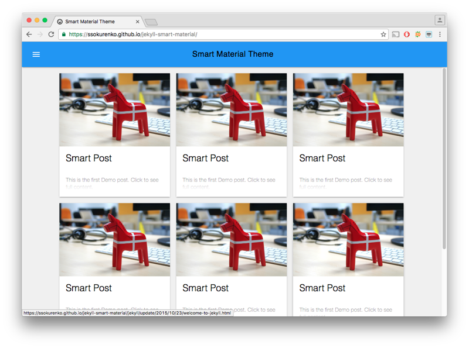

# Jekyll Smart Material

Slick Material Design theme for [Jekyll](https://jekyllrb.com/) powered by [Material Design Lite v.1.2.1](https://getmdl.io/components/index.html).

## Live demo

[https://ssokurenko.github.io/jekyll-smart-material](https://ssokurenko.github.io/jekyll-smart-material/)

## Local deployment for development and testing

Fork or clone the project: `https://github.com/ssokurenko/jekyll-smart-material.git`

Install Jekyll: `sudo gem install jekyll`

Open the project folder: `cd jekyll-smart-material`

Run local Jekyll server: `jekyll serve`, it will be available at: [http://127.0.0.1:4000/](http://127.0.0.1:4000/).
